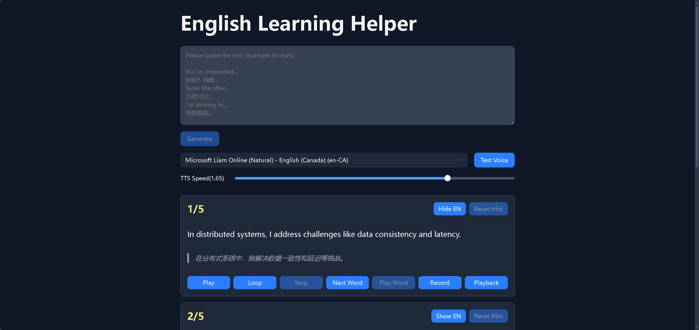

### README.md (Bilingual Version)

[**English**](#english) | [**中文**](#chinese)

## English Learning Helper

English Learning Helper is a Next.js-based web application designed to assist users in learning English.

[Website Link](https://english-learning-helper.vercel.app/)

#### Overview
Welcome to "Language Learning Helper" – a powerful tool specifically designed for language learners! This application aims to help users learn English efficiently. With an intuitive interface and rich features, you can easily improve your listening and speaking skills.

#### Main Features
1. Select TTS voice characters and set the speed.
2. TTS reading: Read or loop English text aloud.
3. Word hints: Display the next word and play the current hint word.
4. Recording and playback: Through the recording and playback functions, you can easily practice your language skills.

#### Usage Methods
1. Paste the text to be practiced (in the format of English and original text side by side) into the top text field, and click the `Generate` button to create practice cards.
2. The original English sentence is hidden by default; you can click the `Show` button in the upper left corner to display it.
3. You can click the `Play` button or `Loop` button to play the current sentence.
4. Try to translate the current original text into English. If you don't know how to translate, you can click the `Next Word` button to view the next word, and you can also click `Play Word` to play the word.
5. You can click the `Record` button to record your own interpretation, then click `Playback` to check your pronunciation.

#### Notes
- Ensure that the browser supports Web Speech API and MediaRecorder API (Chrome or Firefox is recommended).
- Microphone permission is required for the first use of the recording function.

Thank you for using it! If you have any questions or suggestions, please feel free to provide feedback, and I will continue to improve!

## 英语学习助手

English Learning Helper是一款基于 Next 的 Web 应用程序，用于帮助用户学习英语。

[网址链接](https://english-learning-helper.vercel.app/)

#### 概述
欢迎使用“语言学习助手”——一款专为语言学习者设计的强大工具！本应用旨在帮助用户高效学习英语。通过直观的界面和丰富的功能，您可以轻松提升听力和口语。

#### 主要功能
1. 选择TTS语音角色并设置速度。
2. TTS朗读: 朗读或循环朗读英语文本。
3. 单词提示: 显示下一个单词, 以及播放当前的提示单词.
4. 录音和回放: 通过录音和回放功能，您可以轻松地练习您的语言技能。

#### 使用方法
1. 将要练习的文本(英文和原文上下对照的格式)粘贴进顶部文本域, 并点击`Generate`按钮生成练习卡片。
2. 英语原句默认是隐藏状态, 你可以点击左上角的`Show`按钮显示。
3. 你可以点击`Play`按钮或`Loop`按钮播放当前句子。
4. 试着将当前原文翻译为英文, 如果你不知道怎么翻译, 可以点击`Next Word`按钮查看下一个单词，另外点击`Play Word`可以播放该单词。
5. 你可以点击`Record`按钮录下你自己的口译, 然后点击`Playback`回放检查自己的发音。

#### 注意事项
- 确保浏览器支持 Web Speech API 和 MediaRecorder API（推荐使用 Chrome 或 Firefox）。
- 首次使用录音功能需授予麦克风权限。

感谢使用！如有问题或建议，请随时反馈，我将不断改进！